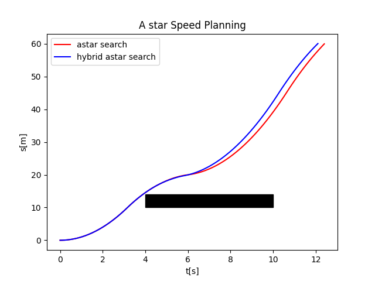

# A star Speed Planning

## 1. Description
This repository is about speed planning of an autonomous driving car. We use A* and Hybrid A* to complete our task.
Moreover, we compared the results of two algorithms.

## 2. Requirement
- python3.7
- numpy
- pandas
- matplotlib

## 3. Usage
- #### run algorithm && generate csv file
```
git clone https://github.com/purewater0901/a_star_speed_planning.git
cd a_star_speed_planning
mkdir build && cd build
cmake ..
make
./main
```

- #### visualize result
```
python script/visualize.py
```

## 4. Result
- Black: Obstacle Occupied Area
- Red:   Optimal Trajectory generated by A*
- Blue:  Optimal Trajectory generated by Hybrid A*



## 5. Reference
- #### Paper
[Hierarchical Trajectory Planning](https://www.researchgate.net/publication/322202031_Hierarchical_Trajectory_Planning_of_an_Autonomous_Car_Based_on_the_Integration_of_a_Sampling_and_an_Optimization_Method)

- #### Code
[A Star](https://github.com/daancode/a-star)


